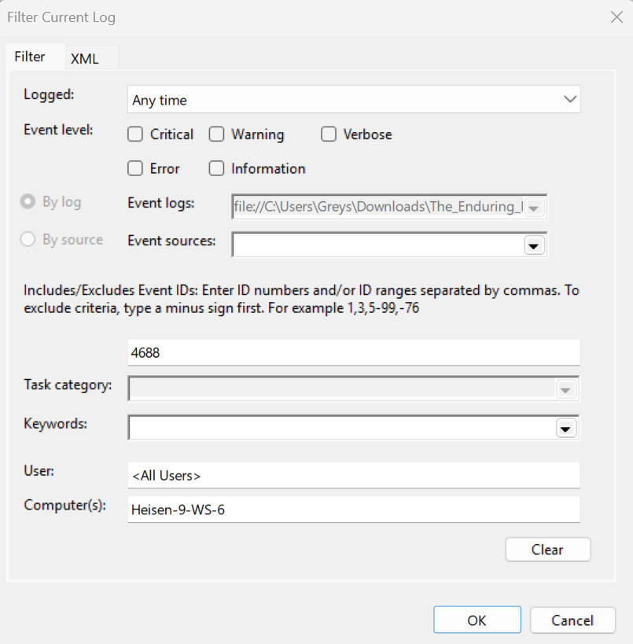
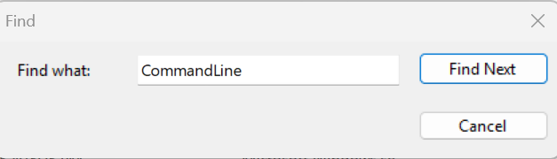
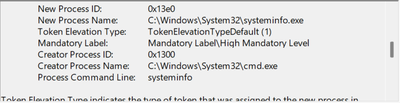

# Homles CTF: "The Endruing Echo"

** Author: ** Greyson Brummer

## Flag 1: First Initial Command

**Question** What was the first non cd command executed by the attacker on the host? (string)

**Walkthrough**
- To begin the challange, we are given a zip file named The_Enduring_Echo.zip.
- The file is a compressed foresic capture of a compromised windows host. Including event logs, user profiles, systems artifacs, and NTFS meta data.
- First we will navigate to the "winevt" logs, following the path C\Windows\System32\winevt\logs
- The first place I thought to check was the Security.evtx 

- Opening the log in Event Viewer, we can filter for the Event ID of Process Creations (4688).
- From the pervious challanges we know the attacker is using the computer "Heisen-9-WS-6" so we can filter for logs only containing this computer

- To further narrow down our search we can use the __Find__ feature to search for executed commands

-After Skimming the logs, we see that at **8/24/2025 6:51:09 PM** there is an event with the ID 4688 being the first CommandLine event.

-As you can see the process command line value is systeminfo.

**Answer:** systeminfo

## Flag 2: Parent Process

